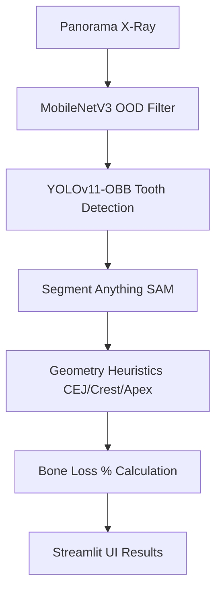
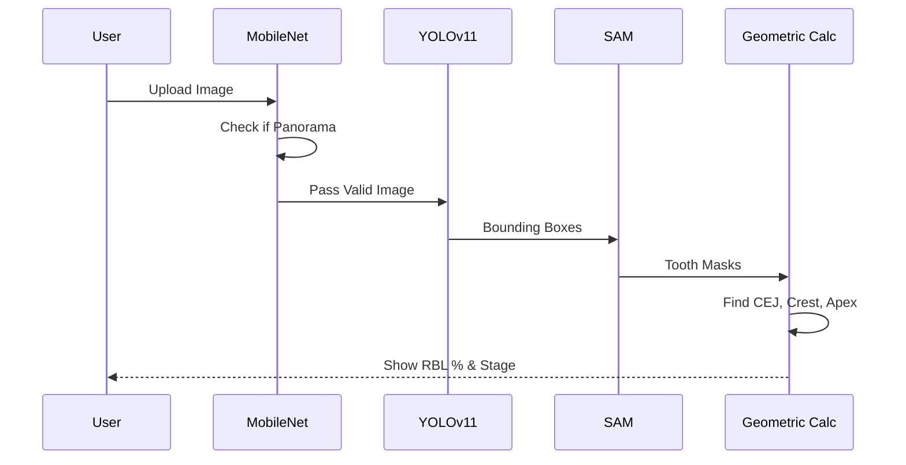

# Pano Bone Loss Measurement

딥러닝을 활용하여 파노라마 방사선 사진에서 치아를 검출하고, 제로샷 기반 마스킹(SAM)을 통해 주요 랜드마크(CEJ, Crest, Apex)를 추출하여 치주염에 따른 치조골 소실량(RBL, Radiographic Bone Loss)을 자동으로 측정하는 AI 시스템입니다.

## Technical Architecture & Workflow

### Architecture Diagram

### Sequence Diagram

##  Key Features
- **OOD Rejection Filter**: MobileNetV3를 기반으로 입력 이미지가 파노라마인지 여부를 사전에 판별하여 치근단/일반 사진 등 잘못된 입력을 차단합니다.
- **Tooth Detection**: `ufba-425` 데이터셋으로 커스텀 학습된 YOLOv11-OBB 모델을 통해 개별 치아 위치 및 각도를 정확하게 바운딩합니다. (ONNX Runtime 적용)
- **Zero-shot Landmark Detection**: Meta의 SAM 파운데이션 모델을 결합하여 치아 마스크를 추출합니다. OOM 방지를 위해 2-Stage ROI 패치 크롭 후 기하학 분석으로 주요 포인트(CEJ, Alveolar Crest, Root Apex)를 유추합니다.
- **Bone Loss Calculation & Calibration**: 랜드마크 좌표를 통해 골소실 퍼센트(%)를 산출하며, 픽셀-물리적 거리(mm) 스케일 팩터 연산을 통해 절대적인 골흡수량을 함께 제공합니다.
- **Global Periodontitis Staging**: 각 치아의 RBL(%) 수치를 바탕으로 실제 치주질환 진단 가이드라인에 따른 임상적 병기(Stage I~IV) 및 Extent를 자동 판정합니다.
- **Hugging Face Model Deployment**: Streamlit 앱 초기화 시 Hugging Face Hub를 통해 최신 딥러닝 가중치를 자동 다운로드하고 ONNX로 변환하여 CPU 추론을 최적화합니다.

## ️ Tech Stack
- **Deep Learning**: PyTorch, Ultralytics(YOLOv11), Segment-Anything, Torchvision, ONNX Runtime, Hugging Face Hub
- **Computer Vision**: OpenCV, Scipy
- **Web/UI**: Streamlit

##  Future Work
- **1. SAM 휴리스틱 정밀도 개선 및 수동 라벨링 데이터셋 구축**
  - 현재 SAM 기반 마스크 추출 후 기하학 수식(y축 기준 30%, 40% 등)으로 랜드마크를 추정하고 있으므로, 다양한 치아 형태(매복치, 기형치 등)에 취약할 수 있습니다.
  - 추후 전문의가 직접 어노테이션한 랜드마크 데이터셋(Keypoint GT)을 구축하여 YOLO-Pose 형태의 End-to-End 회귀 모델로 고도화해야 합니다.
