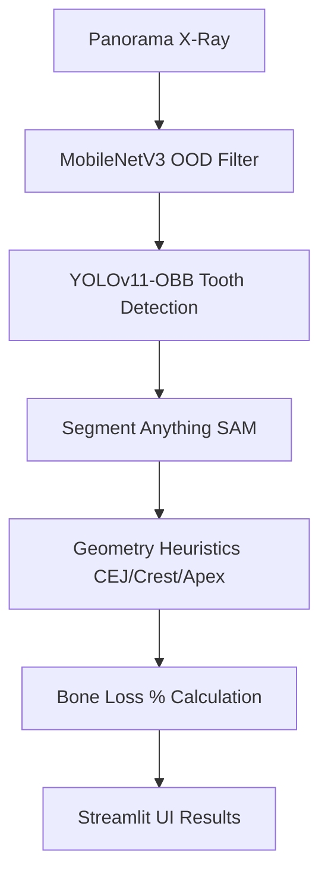
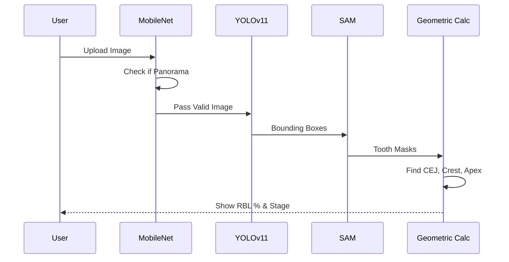

# Pano Bone Loss Measurement

    


## 개요
딥러닝을 활용하여 파노라마 방사선 사진에서 치아를 검출하고, 제로샷 기반 마스킹(SAM)을 통해 주요 랜드마크(CEJ, Crest, Apex)를 추출하여 치주염에 따른 치조골 소실량(RBL, Radiographic Bone Loss)을 자동으로 측정하는 AI 시스템입니다.

## 설치 및 실행 방법
이 프로젝트는 대용량 데이터셋과 사전 학습된 모델 가중치(Checkpoints)가 필요합니다. 
(GitHub에는 소스코드만 올라가 있습니다.)

1. 프로젝트를 클론한 후, 먼저 `setup_env.py` 스크립트를 실행하여 데이터와 가중치를 허깅페이스에서 다운로드하세요.
   ```bash
   pip install huggingface_hub
   python setup_env.py
   ```
2. **주의사항 (`.env` 파일):** 
   이 프로젝트를 온전히 실행하기 위해서는 로컬 환경변수나 API 키가 포함된 `.env` 파일이 필요할 수 있습니다. 클론해서 사용하실 분은 레포지토리 주인에게 별도로 연락하여 `.env` 파일을 요청해 주시기 바랍니다.

## 개요

### Architecture Diagram

### Sequence Diagram


##  Key Features
- **OOD Rejection Filter**: MobileNetV3를 기반으로 입력 이미지가 파노라마인지 여부를 사전에 판별하여 치근단/일반 사진 등 잘못된 입력을 차단합니다.
- **Tooth Detection**: `ufba-425` 데이터셋으로 커스텀 학습된 YOLOv11-OBB 모델을 통해 개별 치아 위치 및 각도를 정확하게 바운딩합니다.
- **Zero-shot Landmark Detection**: Meta의 SAM(Segment Anything) 파운데이션 모델을 결합하여 치아의 픽셀 단위 마스크를 추출하고, 외곽선 기하학 분석을 통해 주요 포인트(CEJ, Alveolar Crest, Root Apex)를 유추합니다.
- **Bone Loss Calculation**: 추정된 랜드마크 좌표를 통해 CEJ-Apex 대비 CEJ-Crest 길이 비율을 계산, 임상적인 골소실 퍼센트(%)를 산출합니다.
- **Streamlit UI**: 의료진 및 사용자가 엑스레이 이미지를 업로드하고 즉시 시각화된 결과를 확인할 수 있는 웹 인터페이스를 제공합니다.

## ️ Tech Stack
- **Deep Learning**: PyTorch, Ultralytics(YOLOv11), Segment-Anything, Torchvision
- **Computer Vision**: OpenCV, Scipy
- **Web/UI**: Streamlit

##  Future Work (앞으로 해야 할 일)
- **1. SAM 휴리스틱 정밀도 개선 및 수동 라벨링 데이터셋 구축**
  - 현재 SAM 기반 마스크 추출 후 기하학 수식(y축 기준 30%, 40% 등)으로 랜드마크를 추정하고 있으므로, 다양한 치아 형태(매복치, 기형치 등)에 취약할 수 있습니다.
  - 추후 전문의가 직접 어노테이션한 랜드마크 데이터셋(Keypoint GT)을 구축하여 YOLO-Pose 형태의 End-to-End 회귀 모델로 고도화해야 합니다.
- **2. YOLO 추론 로직 정상화 및 후처리(NMS) 강화**
  - `models/detector.py` 내부에 임시(Dummy)로 작성된 반환 코드를 실제 `self.model.predict` 결과로 교체하고, 중복 검출 방지를 위한 NMS 로직을 고도화해야 합니다.
- **3. 임상 평가 및 Bone Loss 병기(Stage) 판정 추가**
  - 측정된 RBL(%) 수치를 바탕으로 실제 치주질환 진단 가이드라인(AAP/EFP Classification 등)에 따른 Stage I~IV 자동 분류 기능을 추가해야 합니다.

## 모델 가중치 (Model Weights)
학습된 모델 가중치는 Hugging Face Hub에서 자동으로 다운로드됩니다. 로컬에 가중치 파일이 없는 경우 앱 구동 시 자동 Fallback이 작동합니다.
- **HF Repository**: [`chemahc94/pano-boneloss-weights`](https://huggingface.co/chemahc94/pano-boneloss-weights)
- **파일 목록**:
  - `best.pt` - YOLOv11-OBB 치아 검출 모델
  - `pano_classifier.pt` - MobileNetV3 파노라마 OOD 분류기
- **SAM 가중치**: Meta 공식 배포처에서 자동 다운로드 (`sam_vit_b_01ec64.pth`, 375MB)

수동 다운로드가 필요한 경우:
```python
from huggingface_hub import hf_hub_download
hf_hub_download(repo_id="chemahc94/pano-boneloss-weights", filename="best.pt", local_dir="runs/detect/models/detector_train/weights")
hf_hub_download(repo_id="chemahc94/pano-boneloss-weights", filename="pano_classifier.pt", local_dir="models")
```

## 학습 데이터셋 출처 (Dataset Sources)
- **UFBA-UESC Dental Images Deep Dataset (ufba-425)**: 브라질 UFBA/UESC 대학 공동 구축 파노라마 방사선 사진 공개 데이터셋. 425장의 치과 파노라마 X-ray에 대해 치아 단위 바운딩 박스 어노테이션이 제공됨. YOLOv11-OBB 치아 검출 모델의 훈련에 사용. [https://data.mendeley.com/datasets/hxt48yk462](https://data.mendeley.com/datasets/hxt48yk462)
- **Segment Anything Model (SAM)**: Meta AI Research에서 공개한 범용 이미지 분할 파운데이션 모델. 치아 마스크 추출 및 랜드마크 기하학 분석에 활용. [https://github.com/facebookresearch/segment-anything](https://github.com/facebookresearch/segment-anything)

## 라이선스 (License)
MIT License

